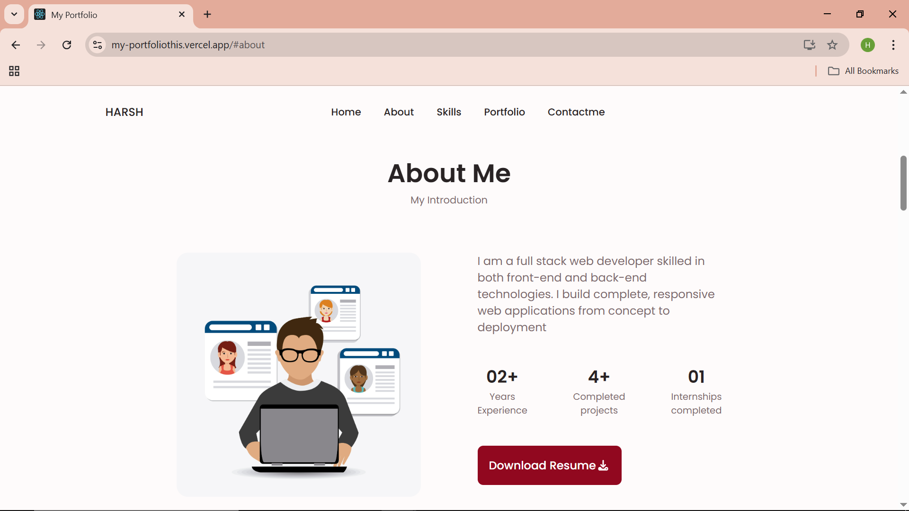
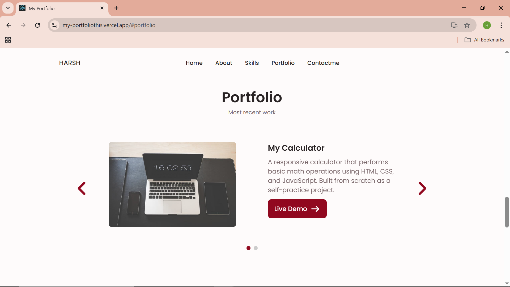
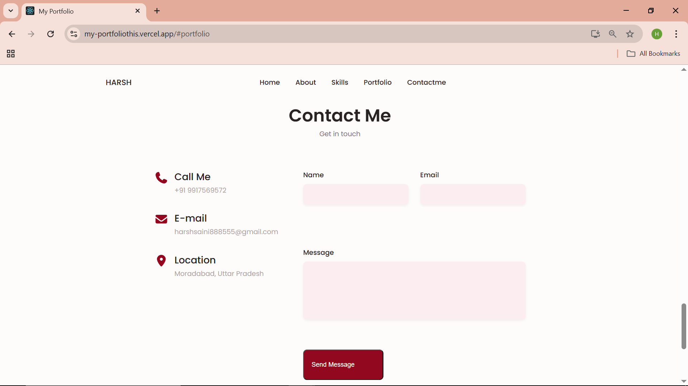

# 🚀 Personal Portfolio Website using MERN Stack

## 🎯 Project Title & Objective
**Title:** Personal Portfolio Website using the MERN Stack (MongoDB, Express.js, React, Node.js)  

**Objective:**  
The main goal of this project is to create a **full-stack personal portfolio website** to showcase my skills, projects, and achievements while demonstrating my expertise in the MERN stack.  

**Key Objectives:**  
- 🖥️ Showcase professional skills, projects, and resume  
- ✉️ Implement a **contact form** with backend integration and MongoDB storage  
- ☁️ Deploy frontend and backend on cloud platforms (**Vercel**, **Render**)  
- 🔧 Gain hands-on experience in **full-stack development, API integration, and deployment**  

---

## 📝 Brief Description
This portfolio website is a modern, fully functional **MERN stack application** designed to demonstrate my **full-stack development skills**.  

**Highlights:**  
- **Frontend:** React.js with **FontAwesome** icons and **Swiper.js** slides  
- **Backend:** Node.js + Express.js with a POST API to save contact form submissions to MongoDB
- **Database:** MongoDB storing contact form submissions securely  
- **Features:**  
  - 💾 Resume download button  
  - ✨ Fully validated contact form using **React Hook Form**  
  - 🔗 Frontend-backend integration to fetch and submit data  
- **Deployment:**  
  - 🌐 Frontend hosted on **Vercel**  
  - 🌐 Backend hosted on **Render**  
  - 🗄️ Database hosted on **MongoDB Atlas**  

---

## 🔗 GitHub Repository
[GitHub Repo](https://github.com/Harsh-Builds/My-Portfolio)  

---

## 🌐 Live Demo Links
- **Frontend:** [Vercel Demo](https://my-portfoliothis.vercel.app)  
- **Backend API:** [Render API](https://my-portfolio-65x9.onrender.com)  

---

## 🛠️ Technologies Used
- **Frontend:** React.js, HTML5, CSS3, JavaScript  
- **Backend:** Node.js, Express.js  
- **Database:** MongoDB, Mongoose  
- **Libraries & Tools:**  
  - FontAwesome (icons)  
  - Swiper.js (carousel/slider)  
  - React Hook Form (form validation)  
  - **API Calls:** Using native `fetch` for making HTTP requests  
  - dotenv (environment variables)  
- **Deployment Platforms:** Vercel (frontend), Render (backend), MongoDB Atlas  

---

## ⚙️ How to Run the Project Locally

### Frontend
```bash
cd client
npm install
npm start

### Backend
cd server
npm install
# Create a .env file with your MongoDB URI and PORT
npm run server


## 🧩 Challenges Faced & Solutions

**Integrating frontend with backend API:**  
Solution: Used native `fetch` and React Hook Form for smooth form submission and validation.

**Deploying frontend and backend on different platforms:**  
Solution: Configured environment variables and CORS correctly.  

**Secure MongoDB connection:**  
Solution: Used `.env` for credentials and Mongoose schemas.  

---

## 🖼️ Screenshots of Application UI

**🏠 Home Page:**  
[home](image.png) 

**👤 About Section:**  


**💼 Projects Section:**  


**✉️ Contact Form:**  


**On Mobile view**
![Mobile view]](image-4.png)
---

---

## ✨ Feature List
- 📱 Fully responsive **mobile-first design**  
- 💾 Resume download button  
- ✉️ Contact form with backend integration and MongoDB storage  
- ✅ Form validation using React Hook Form  
- 🖼️ Interactive project slider with Swiper.js  
- 🎨 FontAwesome icons for enhanced UI  
- 🌐 Frontend hosted on Vercel and backend on Render  

**🎁 Bonus Features:**  
- Smooth scrolling animations  
- Mobile-friendly UI  
- Fully functional API integration  
